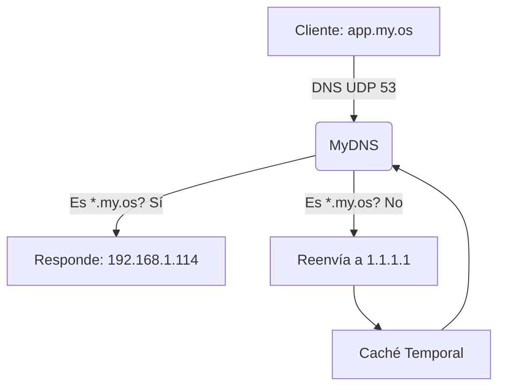

# MyDNS

MyDNS es un servidor DNS ligero y de alto rendimiento escrito en Go, diseñado para actuar como un resolvedor comodín (wildcard) para entornos locales o mini-PaaS caseros.

## Características Principales

- **Resolución Comodín (Wildcard DNS)**: Intercepta todas las consultas para una zona interna (ej. `*.my.os`) y responde siempre con una IP configurada (`TARGET_IP`). Esto permite delegar el enrutamiento a un Reverse Proxy basándose en el header HTTP `Host`.
- **Reenvío (Forwarding)**: Actúa como proxy DNS. Si la consulta no pertenece a la zona interna, la reenvía a servidores DNS externos (como `1.1.1.1` o `8.8.8.8`).
- **Caché en Memoria**: Implementa una caché rápida con soporte TTL para las consultas externas, reduciendo la latencia y el tráfico saliente.

## Arquitectura



## Requisitos
- [Docker](https://www.docker.com/) instalado en el host.

## Despliegue con Docker

La forma más sencilla de ejecutar MyDNS es mediante Docker.

### 1. Construir la imagen

```bash
docker build -t mydns .
```

### 2. Ejecutar el contenedor

Usa el siguiente comando para correr MyDNS en segundo plano, exponiendo el puerto `53` (TCP/UDP).

```bash
docker run -d \
    --name mydns \
    -p 53:53/udp \
    -p 53:53/tcp \
    -e TARGET_IP="192.168.1.114" \
    -e DNS_PORT="53" \
    --restart unless-stopped \
    mydns
```

### Variables de Entorno
- `TARGET_IP`: La IP que responderá a las consultas de la zona interna (Por defecto: `192.168.1.114`).
- `DNS_PORT`: El puerto interno donde escuchará el servidor (Por defecto: `53`).

## Testing Local

El proyecto cuenta con una robusta suite de tests unitarios y de integración para asegurar la funcionalidad de sus componentes (`cache`, `resolver`, `forwarder` y `server`).

Para correr los tests en tu entorno de desarrollo local (teniendo Go >= 1.25 instalado):

```bash
go test -v ./...
```
